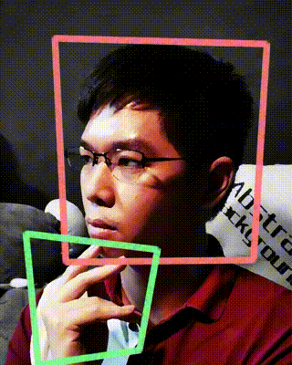

---
# Feel free to add content and custom Front Matter to this file.
# To modify the layout, see https://jekyllrb.com/docs/themes/#overriding-theme-defaults

layout: home
---

## **A Roboticist, ...**
Specialized in **ROS 1/2** (Robot Operating System), **Computer Vision**, **Robot-Lift** Integration and **Heterogenuous Robotic Fleet Management (Open-RMF)**. 
## **Also a Concept Artist & Cartoonist**

Support me with a cup of coffee, either as a donation or an actual cup of coffee. Always down to chill and talk over drinks.

